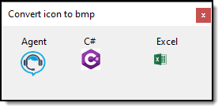

# About

Base class project setup for C#9, .NET Core 5


```csharp
private void OnFormShown(object? sender, EventArgs e)
{
    var fileName = Path.Combine(AppDomain.CurrentDomain.BaseDirectory, "Icons", "agent1.ico");

    Agent1PictureBox.Image = Converters.FromBytesToBitMap(fileName);

    fileName = Path.Combine(AppDomain.CurrentDomain.BaseDirectory, "Icons", "Csharp.ico");
    cSharpPictureBox.Image = Converters.FromBytesToBitMap(fileName);

    fileName = Path.Combine(AppDomain.CurrentDomain.BaseDirectory, "Icons", "Excel.ico");
    // use extension method
    ExcelPictureBox.LoadIconFromFile(fileName);
}
```

### Methods

|Scope|Method/property   |Definition   |
| :---         |  :---  | :--- |
|public|FromIconToBitmap :small_orange_diamond:   |Convert from icon to bitmap   |
|public|BytesToIcon :small_orange_diamond:   |Convert byte array to Icon   |
|public|FromBytesToBitMap :small_orange_diamond:   |Read file contents and convert to BitMap   |
|public|ByteArrayFromImageToImage :small_orange_diamond:   |Read file contents and convert to BitMap   |
|public|ByteArrayFromVarBinaryToImage :small_orange_diamond:   |Read file contents and convert to BitMap   |

:small_orange_diamond: method




