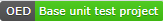

# About

- Base starter [Shouldly](https://github.com/shouldly/shouldly/tree/master/documentation) unit test project.
- This file may be deleted if there is no need for information provided.
  - The assert folder should be deleted if this file is deleted.

## Provides

|Class|Provides   |
| :---         |  :---  |
|TestBase | A place any `initialization code` and `mock-up code` here for unit test methods   |
|TestTraitsAttribute| The ability to setup meaningful [trait attributes](https://docs.microsoft.com/en-us/visualstudio/test/run-unit-tests-with-test-explorer?view=vs-2019) for visual separation of unit test categories  |

